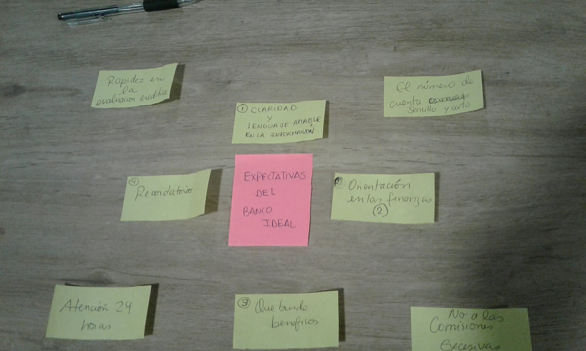

## Reto UX : Banco Millenial
## Desarrollado para
[Laboratoria](http://laboratoria.la)

> Track: Common Core.  
Unidad: Segundo  Proyecto UX.

# **RETO UX : CREAR UN BANCO 100% DIGITAL DIRIGIDO PARA MILLENIALS.**

El Banco del País es uno de los bancos más importante de tu país. Es una institución de muchos años y actualmente está pasando por un proceso de transformación digital. Como parte de este proceso, han implementado un área de innovación que quiere llegar de una mejor manera a los usuarios más jóvenes. Por lo que, inspirados en Nequi, Nubank y Simple se han propuesto crear un banco 100% digital dirigido para millenials.

# ***DESARROLLO DEL PROYECTO***

#### Día 1

### **PLANIFICACIÓN**

  

#### Día 1 :
  - Planificación del trabajo.  
  - BENCHMARKING:
     Nequi, Nubank, Simple.
     Fintech Nacionales.
  - Business Model Canvas
  - Plan Reunión KICKOFF
  - Planteamiento de preguntas a usuarios.

#### Día 2 :  
  - Planteamiento de preguntas a usuarios.
  - Elaboración de cuestionario /10 Preguntas (Online)  y guia de entrevista.
  - Elaboración de guia de entrevista a los Stackholders.

- **Ux Research** : Entrevistas a usuarios.  
- **Análisis de Usuario**  : Analizando la información recaudada.
    - Realizar un mapa de afinidad para detectar las necesidades del usuario.
    - Investigar empresas que ofrezcan servicios similares a las necesidades de los MILLENIALS.  

#### Día 3 :  
-  **Mapa de afinidad**
      - Realizar un mapa de afinidad o lluvia de ideas para detectar las necesidades del usuario.
      - Priorizar y decidir las necesidades que vamos a abordar
      - Potenciar y enfocar nuestro Business Model Canvas .
      - Hacer un benchmarking y buscar referencias relacionadas a la necesidades que buscamos satisfacer.  
- **Presentación del Propuesta** :
    -   Elaboracion de prototype.

#### Día 4:  
- **Definir el MVP**
    - Priorizar lista de features y definir el MVP.  

#### Día 5:
- **Testeo**
     - Hacer un content prototype.  
     - Testearlo en pareja con compañeras de otro squad.
     - Testeo del prototype a diferentes personas enfocandonos en los Milleneals.

#### Día 6:
- **Exposicion final**
     - Testeo del la ultima versión del prototype.
     - Presentación final del prototype.

#### Día 2

## **UX RESEARCH Y ANALISIS DE USUARIO.**

## **Entrevistas.**

  

- Entrevistamos a 5 Milleneals de entre 23 a 27años para evaluar sus necesidades.
- Grabamos las entrevistas de los usuarios para centrarnos en el lenguaje corporal.  

### **Preguntas:**
1.	¿Cuántos años tienes?

2.	¿Aquí te dedicas?

3.	¿En qué distrito vives?

4.	Tienes alguna cuenta en el banco (crédito –debito)

5.	¿Cómo se llama el banco?

6.	¿Cómo manejas tus finanzas?

7.	¿Conoces los servicios que te ofrece el banco?

8.	¿Qué operaciones realizas con frecuencia? ¿A través de que medio?

9.	¿Probaste usar la banca por internet o aplicación?

10.	¿Te parece útil hacer tus transacciones por internet? ¿Atreves de que plataforma regularmente?

11.	¿Cuándo fue la última vez que realizaste una transacción financiera?

12.	¿Qué proceso realizaste y como te sentiste?

13.	¿Alguna vez has realizado un préstamo financiero? ¿Cuál fue el motivo?

14.	¿Tienes el hábito de ahorrar?

15.	¿Te gustaría que el banco te brinde consejos de ahorro?

16.	¿Qué características o servicios te gustaría a ti que un banco te proporcione?

#### **Respuesta de uno de los entrevistados:**

  - *No tengo una cuenta en el banco.*   
  - *Ahorro en mi chanchito.*  
  - *Page un curso en la universidad por medio de la tarjeta de mi enamorado.*  
  - *No tengo mucha información de los servicios que ofrece un banco.*  
  - *Me gustaria que me ayude a controlarme en no gastar en cosas que no necesito .*

#### **Según las encuestas que realizamos el 60% de los Milleneals nos indican que desean :**  

- Información.  

## **Encuestas on-line.**
Se encuesto a 24 Milleneals entre 20 y 29 años para averiguar sus necesidades así como inquietudes más recurrentes que atraviezen.

   

#### Día 3
## **DIAGRAMA DE AFINIDAD**

Se desarrolló el análisis de las encuestas realizadas para poder recopilar toda la información sumando los resultados de las entrevistas presenciales.

Empleamos el **Diagrama de Afinidad** para poder identificar  y clasificar los diversos problemas encontrados.

Se consideró clasificar las necesidades e inconvenientes por temas.

Por ejemplo :
- Información más clara y sencilla de entender.
- Disponer de todas sus cuentas desde una sola aplicación .
- Poder realizar diversas transacciones sin exceso de cobro en comisiones.
- Beneficios por el uso de sus operaciones.
 -

#### Día 4
## **DIAGRAMA DE AFINIDAD**

#### Día 5:
- **Testeo**

     - Se logro  testearlo en pareja con compañeras de otro squad asimilando  de manera efectiva el feedback correspondiente.
     - Se realizo testeo tambien con usuario(milleneals 5) y mostraron gran interest por la sencilles y grandes beneficios que les proporciona Kimoni .

#### Día 6:
- **Exposicion final**
     - Testeo del la ultima versión del prototype.
     - Presentación final del prototype.

     
